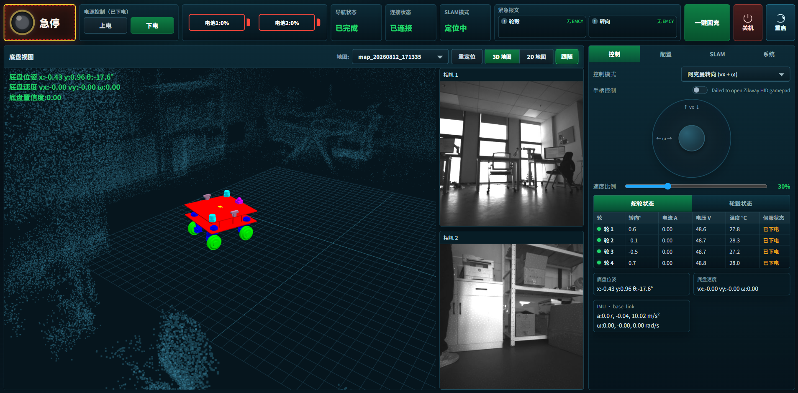

<p align="center">
  
</p>

<h1 align="center">MODI CHASSIS SYSTEM</h1>

<p align="center">
  面向 MODI 四舵轮底盘的控制、建图、定位与导航 Web 示教器
</p>

<p align="center">
  
  
  
  
  
</p>

<p align="center">
  <a href="docs/frontend-user-guide.md"><strong>用户使用手册</strong></a>
  ·
  <a href="#主要功能"><strong>主要功能</strong></a>
  ·
  <a href="#底盘界面"><strong>界面说明</strong></a>
  ·
  <a href="#开始使用"><strong>快速开始</strong></a>
  ·
  <a href="#安全提示"><strong>安全提示</strong></a>
</p>

---

## 系统简介

MODI CHASSIS SYSTEM 为 MODI 提供底盘控制、状态管理、参数配置与故障诊断能力。 配套的 MODI CHASSIS SCOPE 将常用功能集中到浏览器中，无需安装桌面客户端，即可完成从手动控制移动、建图、定位、导航的完整操作流程。

系统服务随设备开机自动启动。操作终端与设备网络连通后，通过浏览器访问设备地址即可进入控制页面。

## 主要功能

| 功能           | 说明                                                                                                     |
| -------------- | -------------------------------------------------------------------------------------------------------- |
| 安全与设备状态 | 集中显示急停、上下电、双电池电量、导航状态、连接状态、SLAM模式、关节紧急报文、一键回充、系统的关机与重启 |
| 实时3D视图     | 显示地图点云，实时底盘位姿                                                                               |
| 实时2D视图     | 显示栅格地图、实时底盘位姿、目标点、规划路径                                                             |
| 手动控制       | 支持阿克曼转向和全向纯平移虚拟摇杆                                                                       |
| 手柄控制       | 管理车端手柄开关、连接状态和指令统计                                                                     |
| 建图与定位     | 启动建图、保存地图、选择地图和重定位                                                                     |
| 地图编辑       | 添加虚拟墙，擦除地图                                                                                     |
| 路径导航       | 编辑路径点，保存 JSON，执行循环或单次导航                                                                |
| 参数配置       | 配置最大线速度、最大角速度、线加速度和角加速度                                                           |
| 充电桩设置     | 手动设置充电桩位置                                                                                       |
| 系统诊断       | 实时查看和导出日志、查询故障码，并提供版本与升级功能入口                                                 |

## 底盘界面

页面由顶部状态栏、左侧底盘视图和右侧功能标签页组成。



右侧主标签页：

- `控制`：手动控制、手柄、舵轮、轮毂和 IMU；
- `配置`：底盘运动参数和充电桩位置；
- `SLAM`：建图、地图编辑、定位和导航；
- `系统`：日志、版本、升级和故障码查询。

# 开始使用

1. 打开操作终端上的浏览器，进入设备部署人员提供的 MODI CHASSIS SCOPE 地址；常用地址格式为 `http://<设备地址>:8088`。
2. 确认页面顶部连接状态显示“已连接”。
3. 确认电机状态，关节紧急报文。
4. 确认底盘周围障碍物，再进行上电和运动操作。

界面的详细使用方式请查看：[MODI Chassis Scope 用户使用手册](docs/frontend-user-guide.md)

# 安全提示

> 四轮舵轮底盘运动、导航和参数修改均可能引发设备动作或安全事故。仅允许经过培训的人员操作，软件急停不能替代物理急停。

- 首次操作从低速比例开始，并确认各舵轮和底盘的实际运动方向。
- 上电、建图或导航前清空底盘工作区域，确认地图、定位、传感器和物理急停正常。
- 修改运动参数、地图或路径后，必须在安全区域内进行低速验证。
- 切换手动、导航或手柄控制前，确认底盘周围及行驶路径处于安全状态。
- 出现异常时立即停止运动；必要时触发物理急停，排除故障后再恢复运行。

# 发布包中的文档位置

MODI CHASSIS SYSTEM 发布压缩包内包含完整的 MODI SCOPE 用户手册和截图：

```
share/modi_chassis_scope/docs/
├── frontend-user-guide.md
```

文档可随发布包离线查看，图片使用相对路径，不依赖外部网站。
