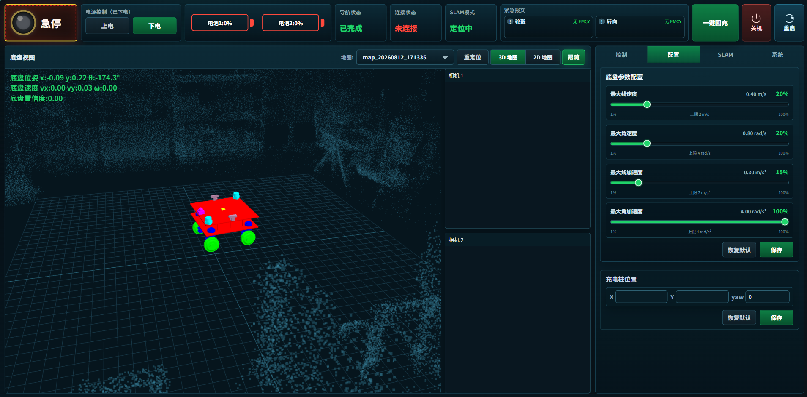
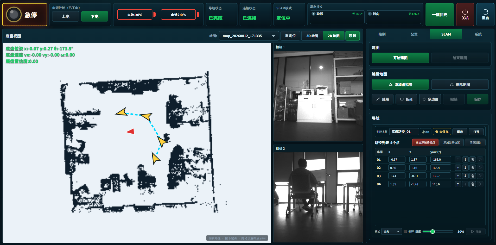
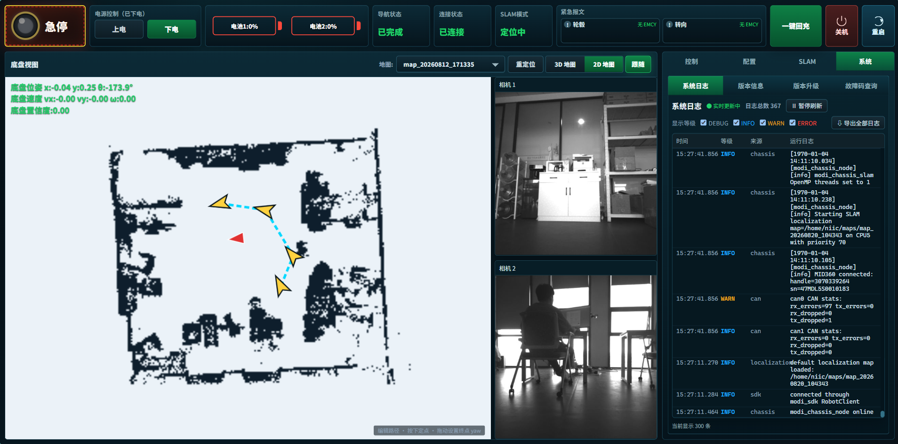
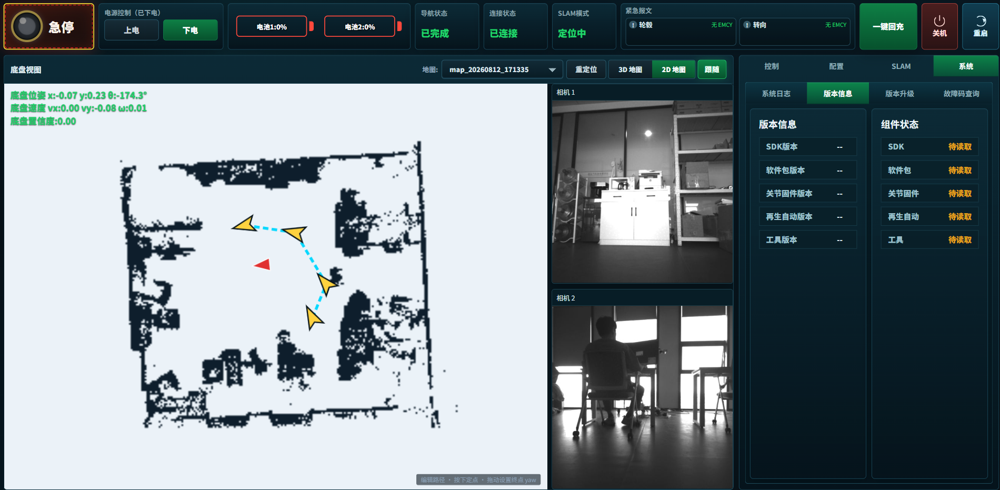
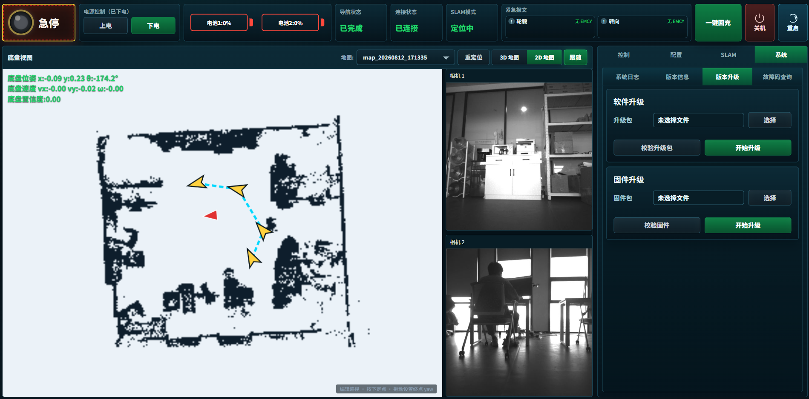
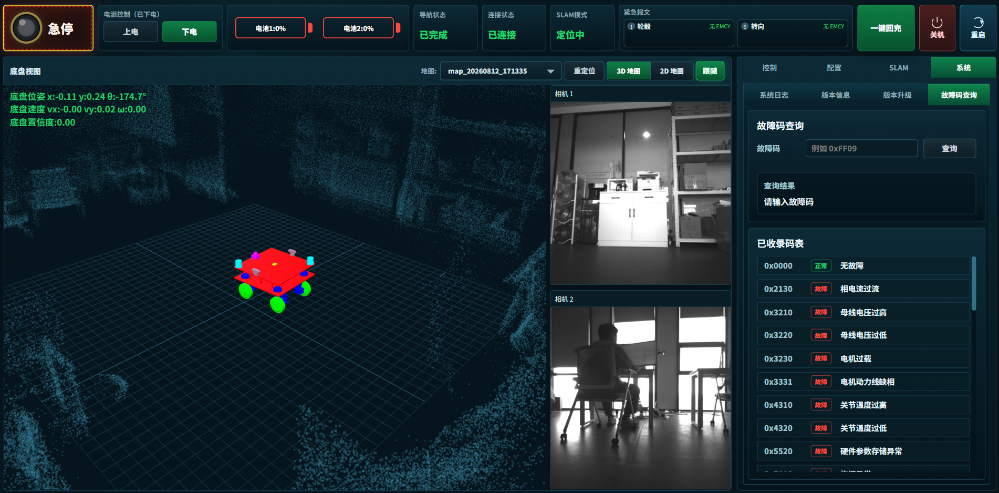

# MODI Chassis Scope 前端使用说明

本文面向使用 MODI 四轮舵轮底盘的操作和维护人员，用于说明 Web 操作界面中各项功能的用途及使用方法。

> **安全提示**：四轮舵轮底盘运动、导航和参数修改均可能引发设备动作或安全事故。仅允许经过培训的人员操作，软件急停不能替代物理急停。

## 1. 打开界面

1. 打开操作终端上的浏览器，进入 MODI Chassis Scope 页面。访问地址由设备部署人员配置，常用地址为 `http://<设备地址>:8088`。
2. 检查顶部“连接状态”是否为“已连接”。
3. 检查急停、电池电量、导航状态、SLAM 模式和关节紧急报文。
4. 确认底盘周围和计划行驶区域安全，再执行上电、手动控制、建图或导航。

系统服务随设备开机自动启动。若页面无法访问或长时间显示“未连接”，请按“常见问题”中的方法检查，或联系设备维护人员。

## 2. 界面总览

*图 1　MODI Chassis Scope 实际操作界面（底盘控制页）*

界面固定按三个区域组织：

1. **顶部安全与总状态区**：急停、上下电、电池、导航状态、连接状态、SLAM 模式、关节紧急报文、一键回充、关机和重启。
2. **左侧底盘视图区**：在 3D 地图和 2D 地图之间切换，显示底盘模型、点云/栅格地图、当前位置、速度、路径点和充电桩位置。
3. **右侧操作区**：通过页签切换控制、配置、SLAM 和系统设置。

页面会根据窗口大小整体缩放。按钮操作结果显示为短暂的页面提示；失败或错误提示会用醒目样式显示。

## 3. 顶部安全与总状态区

### 3.1 急停

点击“急停”触发软件急停，再次点击用于解除。急停触发后底盘会下电并停止运动；解除后不会自动上电，需要人工确认现场安全后再点击“上电”。

软件急停只能作为辅助措施。出现人员进入危险区域、底盘运动异常或通信异常时，应优先使用物理急停。

### 3.2 上电与下电

- **上电**：急停未触发且底盘当前已下电时可用。
- **下电**：底盘已上电时可用。
- 触发急停、执行下电或发生故障后，应先确认底盘完全停止，再进行下一步操作。

未上电或急停触发时，手动摇杆和导航启动会被禁止。

### 3.3 电池状态

顶部显示两组电池电量及充电状态。电量过低、充电状态异常或电池报警时，不应继续执行长距离导航、建图或高负载运动。

### 3.4 状态卡片

- **导航状态**：显示空闲、运行、完成、失败等导航状态。
- **连接状态**：表示浏览器与网关的 WebSocket 是否连通；断开时页面会尝试重连。
- **SLAM 模式**：显示当前处于建图中或定位中。
- **紧急报文**：按轮毂和转向关节汇总 EMCY。出现故障时会弹出故障窗口，可点击“清故障”，但必须先处理故障原因。

### 3.5 顶部快捷操作

- **一键回充**：点击后底盘自动回充电桩充电。
- **关机 / 重启**：关闭或重新启动底盘系统。

## 4. 底盘视图

视图右上角显示底盘当前位姿速度与定位置信度

### 4.1 3D 地图

3D 地图用于观察底盘模型、实时位姿和点云/地图数据。上方可切换“3D 地图”和“2D 地图”，并可切换“跟随 / 自由”视角。

常用操作：

- 选择“跟随”后，视角跟随底盘位姿移动。
- 选择“自由”后，可自由观察现场点云和底盘模型。

3D 视图用于状态观察，不能代替现场安全确认或高精度测量。

### 4.2 2D 地图

2D 地图用于查看栅格地图、底盘位置、目标点、路径点、虚拟墙、和充电桩位置。以下操作需要在 2D 地图中完成：

- 设置导航路径点。
- 绘制虚拟墙。
- 擦除地图区域。
- 设置充电桩位置。

### 4.3 地图选择与重定位

视图区顶部提供地图选择和“重定位”按钮：

1. 在“地图”下拉框选择需要使用的地图。
2. 页面会调用定位接口加载地图。
3. 定位异常或更换现场环境后，点击“重定位”重新匹配地图。

导航进行中不能切换地图。切换地图前应先停止导航并确认底盘静止。

## 5. 控制界面

进入右侧“控制”页签。只有连接正常、急停解除、底盘已上电且速度参数已加载时，屏幕摇杆才可用。

### 5.1 控制模式

控制模式包含两种：

- **阿克曼转向 (vx + ω)**：摇杆纵向控制前进/后退速度 `vx`，横向控制角速度 `ω`。
- **全向纯平移 (vx + vy)**：摇杆纵向控制 `vx`，横向控制横移速度 `vy`，不主动产生自转。

切换模式时页面会发送停止指令。首次使用或修改参数后，应使用低速度比例确认实际运动方向。

### 5.2 屏幕摇杆

按住摇杆并拖动即可持续发送速度指令，松开、指针移出、窗口失焦或取消操作时会发送停止指令。

使用要求：

1. 确认手柄控制已关闭。
2. 确认底盘已上电且急停未触发。
3. 从较低速度比例开始。
4. 持续观察底盘，不要只依赖页面状态判断是否安全。

### 5.3 速度比例

“速度比例”按当前底盘参数中的最大线速度和最大角速度换算实际指令。比例越高，底盘响应越快。

速度比例只影响前端摇杆下发的目标速度；服务端仍会按底盘配置进行最终限幅和平滑。

### 5.4 手柄控制

打开“手柄控制”后，底盘由车端手柄输入控制，页面会显示手柄连接状态、控制模式、当前速度指令和数据包统计。

打开手柄控制后，屏幕摇杆不可用。需要使用屏幕摇杆时，应先关闭手柄控制。

### 5.5 舵轮、轮毂、位姿和 IMU 状态

控制页下方显示：

- **舵轮状态**：转向角、电流、电压、温度和伺服状态。
- **轮毂状态**：轮速、电流、电压、温度和伺服状态。
- **底盘位姿**：当前定位坐标和航向角；未定位时显示“未定位”。
- **底盘速度**：实时 `vx`、`vy` 和 `ω`。
- **IMU**：线加速度和角速度。

故障或异常状态出现时，应停止运动并查看顶部紧急报文、故障弹窗和系统日志。

## 6. 配置界面

进入右侧“配置”页签，可设置底盘运动参数和充电桩位置。修改参数前应停止底盘，修改后必须低速验证。

### 6.1 底盘参数配置

可配置项包括：

- **最大线速度**：范围 `(0, 2.0] m/s`。
- **最大角速度**：范围 `(0, 2.0] rad/s`。
- **线加速度**：范围 `(0, 3.0] m/s²`。
- **角加速度**：范围 `(0, 6.0] rad/s²`。

页面使用百分比滑块调整配置值。点击“保存”后会弹出确认框，确认后写入服务端；写入成功后页面会重新读取服务端生效值。

“恢复默认”只恢复页面输入，仍需点击“保存”才会下发。

### 6.2 充电桩位置

充电桩位置包含 X、Y 和 yaw：

1. 在配置页手动输入 X、Y、yaw。
2. 或在 2D 地图中开启充电桩位置编辑，并在地图上点选位置。
3. 点击“保存”，确认后保存当前充电桩位置。

“恢复默认”会清空页面中的充电桩位置输入。保存前应确认地图坐标系和现场充电桩位置一致。

## 7. SLAM 界面

进入右侧“SLAM”页签，可进行建图、地图编辑和路径导航。

### 7.1 建图

1. 确认传感器和急停正常。
2. 点击“开始建图”。
3. 使用低速手动控制底盘匀速移动，避免急转、频繁启停和碰撞。
4. 点击“结束建图”。
5. 在弹窗中填写地图名；不填写时使用默认名称 `map_年月日_时分秒`。
6. 点击“确定”后保存地图并结束建图。

点击“取消”会放弃本次编辑地图，并尝试恢复到当前选择的定位地图。

### 7.2 编辑地图

地图编辑需要在 2D 地图中完成。可用工具包括：

- **添加虚拟墙**：支持线段、矩形和多边形。
- **擦除地图**：支持矩形和多边形。
- **撤销**：撤销最近一次未保存的地图编辑操作。
- **保存**：提交当前编辑列表。

保存地图编辑时，页面会按列表顺序提交操作。全部成功后退出编辑。

### 7.3 导航地图和重定位

导航运行中不能切换地图。

### 7.4 路径文件

路径文件保存在浏览器所在电脑，而不是底盘控制器。操作项包括：

- **轨迹名称**：输入 JSON 文件名，最长 40 个字符。
- **保存**：将当前路径点、导航模式、循环选项和速度比例导出为 JSON。
- **打开**：加载本地 JSON 路径文件。

加载路径文件时会校验版本、名称、路径点和选项。当前路径列表已有内容时，可选择追加或覆盖。

### 7.5 添加和编辑路径点

1. 点击“添加路径点”进入路径编辑模式。
2. 在 2D 地图中点击目标位置并设置目标姿态，或点击“添加当前位置”把当前底盘位姿加入路径。
3. 在路径列表中修改 X、Y、yaw。
4. 使用 `↑` / `↓` 调整顺序，使用删除按钮移除路径点。
5. 再次点击“退出添加路径点”后，才可启动导航。

导航运行中路径列表会被锁定，不能编辑、删除、打开或清空路径。

### 7.6 启动路径导航

启动导航前确认底盘已上电、已定位、路径点有效且行驶区域安全。

1. 选择导航模式：
   - **全向**：底盘可按全向能力规划和跟踪。
   - **仅平移**：底盘按纯平移方式导航。
   - **阿克曼**：底盘按阿克曼模式导航。
2. 按需勾选“循环”。
3. 设置导航速度百分比，可边导航边设置。
4. 点击“导航”启动路径导航。
5. 运行中再次点击“导航”按钮可停止导航。

路径列表中每一行也有“导航到这一行”按钮，可单独导航到某个路径点。当前已有导航运行时，只能停止当前导航，不能启动其他路径点。

## 8. 系统界面

进入右侧“系统”页签，可查看日志、版本、升级入口和故障码说明。

### 8.1 系统日志

- 日志每 **500 ms** 刷新一次。
- 默认显示 INFO、WARN、ERROR，可勾选 DEBUG。
- 点击“暂停刷新”冻结当前列表，再次点击继续。
- 当前最多显示最近 300 条匹配记录。
- 点击“导出全部日志”下载 ZIP 压缩包，便于故障分析。

### 8.2 版本信息

SDK、软件包、关节固件、再生自动和工具版本及组件状态。

### 8.3 版本升级

软件升级和固件升级的文件选择、校验与开始。升级应遵循设备发布提供的升级流程。

升级前必须停止运动、下电或进入维护要求的安全状态，并确认升级包版本与硬件匹配。

### 8.4 故障码查询

输入 `0xFF09`、`FF09` 或十进制故障码即可查看已收录说明和处理建议；结果会随输入即时更新。

未收录故障码应结合顶部紧急报文、舵轮/轮毂状态、系统日志和判断。不要仅依据页面结果清除故障或恢复运行。

## 9. 推荐操作流程

### 9.1 首次连接与手动调试

1. 清空底盘周围区域，确认物理急停可用。
2. 打开页面，确认连接状态为“已连接”，紧急报文无异常。
3. 解除急停并上电。
4. 在“控制”页选择低速度比例。
5. 分别验证阿克曼转向和全向纯平移的实际运动方向。
6. 调试结束后停止运动并下电。

### 9.2 建图并用于定位

1. 确认传感器状态正常。
2. 点击“开始建图”。
3. 低速、匀速控制底盘覆盖目标区域。
4. 点击“结束建图”，输入地图名并保存。
5. 保存完成后在地图列表中选择新地图，执行重定位。
6. 确认 2D/3D 视图中的底盘位置与现场一致。

### 9.3 制作并执行路径导航

1. 选择正确地图并完成重定位。
2. 点击“添加路径点”，在 2D 地图中添加目标点。
3. 检查路径列表中 X、Y、yaw 和点位顺序。
4. 保存 JSON 路径文件备份。
5. 选择导航模式和较低速度比例。
6. 单次导航验证通过后，再考虑提高速度或启用循环。

## 10. 常见问题

### 页面显示“未连接”

检查设备网络、网关进程、8088 端口、防火墙和浏览器网络。页面会自动重连，但网关恢复前控制不可用。

### 摇杆不能操作

依次检查浏览器是否连接、底盘是否已上电、急停是否解除、手柄控制是否关闭、底盘速度参数是否加载完成，以及是否存在故障弹窗。

### 底盘不按预期方向运动

立即松开摇杆或触发急停。确认当前控制模式、速度比例、舵轮状态和坐标方向；首次运行、维修后或参数修改后，应从低速小幅操作重新验证。

### 地图或定位不正常

检查是否选择了正确地图、现场环境是否与地图一致、传感器数据是否正常、底盘是否发生过搬动。必要时停止导航并重新定位。

### 无法启动导航

检查底盘是否已上电、是否已定位、路径点是否为空、是否仍处于“添加路径点”模式、导航是否已经运行，以及导航速度比例是否下发成功。

### 路径文件无法加载

确认文件为本界面导出的 JSON，版本为 1，路径点包含 X、Y、yaw，导航模式为支持值。不要手工修改单位或字段名。

### 建图结束后没有看到新地图

保存地图需要后台处理时间。观察页面提示和系统日志；保存完成后刷新地图列表或重新选择地图。若保存失败，应检查 SLAM、磁盘空间和网关日志。

### 出现故障弹窗或 EMCY

停止运动，必要时触发物理急停。记录故障码和日志，排除原因后再点击“清故障”。仅关闭弹窗或重复清故障不能解决实际故障。
